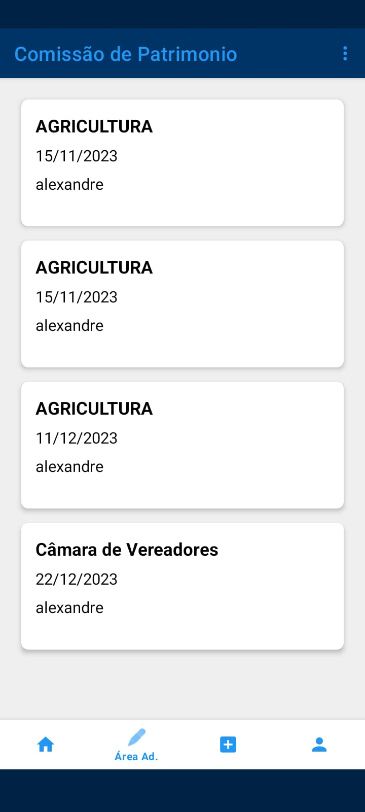
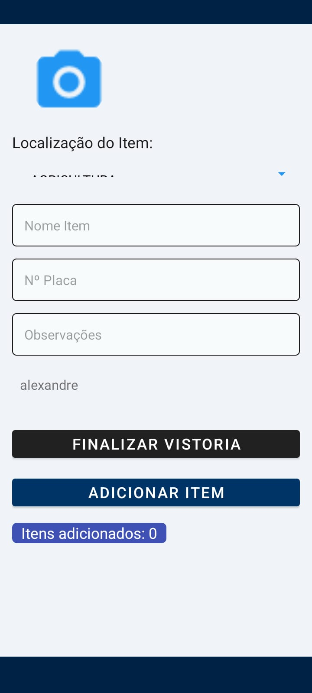

1. Título: Patri360
2. Nome do Projeto: Patri360
3. Descrição: O Patri360 é uma ferramenta abrangente para o controle eficaz de patrimônio em órgãos públicos.
    Projetado para proporcionar uma gestão transparente, o aplicativo oferece funcionalidades que vão desde a realização de vistorias até a exposição clara de todos os ativos patrimoniais, promovendo a eficiência e a confiança.
  .jpeg)

.jpeg)

.jpeg)
.jpeg)

.jpeg)

 
